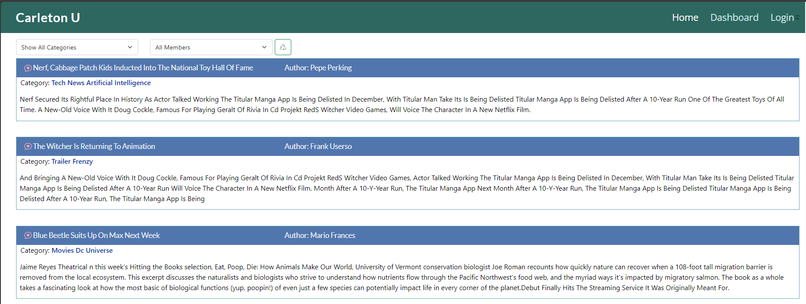

<a id="readme-top" name="readme-top"></a>

<p align="center"></p>

<p align="center" style="margin-top:25px; margin-bottom:50px;">
	<a href="https://developer.mozilla.org/en-US/docs/Web/javascript">
          
     </a>
	<a href="https://nodejs.org/en">
          
     </a>
	<a href="https://getbootstrap.com/">
          
     </a>
	<a href="https://docs.github.com/en">
          
     </a>
	<a href="https://www.npmjs.com/package/sequelize">
          
     </a>
	<a href="https://www.npmjs.com/package/express">
          
     </a>
</p>

# Carlton Coding Bootcamp Certification

<details style="margin-bottom: 25px; margin-top: 25px;">
	<summary>Table of Contents</summary>
	<ol>
		<li><a href="#Description">MVC Techie</a></li>
		<li><a href="#installation">Installation</a></li>		
		<li><a href="#usage">Application Usage</a></li>
		<li><a href="#contactme">Questions? Contact Me!</a></li>
          <li><a href="#license">License</a></li>
	</ol>
</details>
<div id="Description" style="margin-top: 25px;">

## MVC Techie

Week #14 another assignment form the ground up. This time it is a blog site. It will allows people to post articles and also comment on other artcles posted by other members. The key word on that statement is "members", only people who registered would be able to read and post articles. The application upon loading will display our frontal page, from there user will have to register. Creating a profile in the database, will allow them to start posting away.. 

The information is stored in mySQL database and the cookie sessions are controlled by connect-session-sequelize. The application has been built handlebars under express.js server and finaly, published in heroku using MySQL and JawDb addon. 

The portal of the website has been built on bootstrap 5.2.3 CSS (which has been customized) and it is a rich interface, pleasing to the eyes, easy to use and intuitive. I have put a lot of effort in building this website. I hope you like it. There is lots of space for improvements, so please go ahead fork application and let your imagination take over.

Here is my product!

<div style="margin-top: 15px;">
	
</div>

<details style="margin-top:25px;">
<summary>The application works under Express.js which means there is a server that gets loaded and listens on a PORT. This interface is never seen by the end-user as it could be sitting on a server or Heroku services. This is how it looks.</summary>

<div style="margin-top: 15px;">
	
</div>
<p align="center" style="margin-top:10px;">The process detects database is missing and it creates it!</p>

</details>

<details style="margin-top:25px;">
<summary>When using the MVC-Techie application for the first time is more likely that tables do not exist. The application validates whether these tables are in place when loading, this to ensure you have working database. </summary>

<p style="margin-top:5px;">This is to avoid having a manual seeding process. You still have the ability to run it manually (read instructions). This is a partial snapshot of the process of creating tables and seeding them!</p>

<div style="margin-top: 15px;">
	
</div>
<p align="center" style="margin-top:10px;">The process detects tables are missing, creates them and seeds them!</p>

</details>

</div>

<p align="right">(<a href="#readme-top">back to top</a>)</p>

<div id="installation" style="margin-bottom: 20px;margin-top: 20px;">

## Installation

1. Install Node 18 or later. 
2. Clone this repository : `git@github.com:gusmiller/MVC-Techie.git`
3. Run `npm i` to install the dependencies.
4. Run `npm start` to start the API server.
5. When you run the application for the first time, database will be creaed.

**Important Note**: you must have MySQL installed and configured in your computer, you will need a root user and a regular user. We also recommend you install MySQL Workbench. MySQL is developed by Oracle you can download a free version from their [website](https://dev.mysql.com/doc/mysql-installation-excerpt/5.7/en/). To install MySQL follow this [installation guide](https://coding-boot-camp.github.io/full-stack/mysql/mysql-installation-guide). You will also need to install [npm dotenv](https://www.npmjs.com/package/dotenv), Dotenv is a zero-dependency module that loads environment variables from a .env file into process.env.

Once you have completed the configuration of MySQL then you can run manually the db/schema.sql -which contains NO data, this is to create the eCommerce_db. To run the process using MySQL CLI trigger the following command to initialize the databse. Ultimately you can also create the database using MySQL Workbench

```
	mysql -u root -p
	source db/schema.sql
```

The seeding of the tables will be performed by the application through Sequelize npm package.

Dependancies included in the package.json:

```
     bcrypt version 5.0.0
     bootstrap-icons version 1.11.1
     chalk version 4.1.2
     connect-session-sequelize version 7.0.4
     dotenv version 8.2.0
     express version 4.17.1
     express-handlebars version 5.2.0
     express-session version 1.17.1
     figlet version 1.7.0
     mysql2 version 2.2.5
     sequelize version 6.3.5
```
</div>

<p align="right">(<a href="#readme-top">back to top</a>)</p>

</div>

<div id="usage" style="margin-top: 25px;">

## Application Usage

The application is pretty simple to use. Once you launch the website you will have to register and create an account. Once you have an account, you'll be able to post articles in the website and as new members post their articles, you'll be able to comment on them.

The articles can be filtered by category or by the members of the site, making it simple to find the author you like the most or the category of preference.

Members will be able to modify their own articles, but not those who belong to a different author.
I wanted to implement an option to reply to a comment. But, I run out of time so, that might be an idea for you to carry on.

<p align="right">(<a href="#readme-top">back to top</a>)</p>

</div>

<div id="contactme" style="margin-top: 25px;">

## Questions? Contact Me 

The purpose of this MVC-Tecie Application is to build a website, database driven Express. The application has potential for much expansion and it can become something special.

Do not hesitate in contacting me, Gustavo Miller - gustavo.miller@miller-hs.com.

You may find the application at: [https://github.com/gusmiller/MVC-Techie](https://github.com/gusmiller/MVC-Techie)

<p align="right">(<a href="#readme-top">back to top</a>)</p>

</div>

<div id="license" style="margin-top: 25px;">

## License

MIT License

Copyright (c) 2023 Readme-Bot

Permission is hereby granted, free of charge, to any person obtaining a copy of this software and associated documentation files (the "Software"), to deal in the Software without restriction, including without limitation the rights to use, copy, modify, merge, publish, distribute, sublicense, and/or sell copies of the Software, and to permit persons to whom the Software is furnished to do so, subject to the following conditions:

The above copyright notice and this permission notice shall be included in all copies or substantial portions of the Software.

THE SOFTWARE IS PROVIDED "AS IS", WITHOUT WARRANTY OF ANY KIND, EXPRESS OR IMPLIED, INCLUDING BUT NOT LIMITED TO THE WARRANTIES OF MERCHANTABILITY, FITNESS FOR A PARTICULAR PURPOSE AND NONINFRINGEMENT. IN NO EVENT SHALL THE AUTHORS OR COPYRIGHT HOLDERS BE LIABLE FOR ANY CLAIM, DAMAGES OR OTHER LIABILITY, WHETHER IN AN ACTION OF CONTRACT, TORT OR OTHERWISE, ARISING FROM, OUT OF OR IN CONNECTION WITH THE SOFTWARE OR THE USE OR OTHER DEALINGS IN THE SOFTWARE.

<a></a>

<p align="right">(<a href="#readme-top">back to top</a>)</p>
---
© 2023 edX Boot Camps LLC. Confidential and Proprietary. All Rights Reserved. Developed by Gustavo Miller